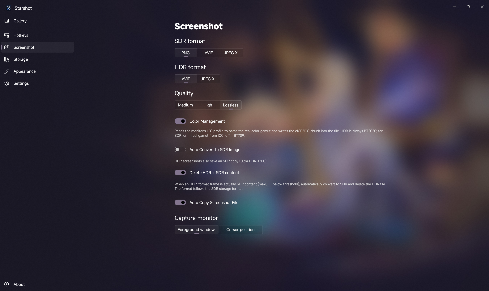

<div align="center">


# Starshot

**Next-generation Windows-native HDR Screenshot Tool**

Full 16-bit HDR Pipeline · Region Screenshot · AVIF / JPEG XL / PNGv3 Encoding · Color Management

[](../../releases)
[](https://github.com/loliri/Starshot?tab=MIT-1-ov-file)
[](../../releases)

[Website](https://starshot.cialo.site) · [Download](https://starshot.cialo.site/download) · [Quick Start](#quick-start) · [Features](#features) · [Build from Source](#build-from-source)

**English** | **[简体中文](README.zh-CN.md)** |
[繁體中文](docs/README.zh-TW.md) | [日本語](docs/README.ja.md) | [Français](docs/README.fr.md) | [Русский](docs/README.ru.md) | [Español](docs/README.es.md)

</div>

---

## Why Starshot

Windows' built-in screenshot tool (Snipping Tool, Win+Shift+S) can only capture 8-bit SDR images even on HDR displays — the system compositor compresses 16-bit HDR frames on output, highlights are clipped, the color gamut is narrowed, resulting in screenshots that appear washed out, overexposed, or have incorrect color mapping. Common third-party screenshot tools are likewise limited by the traditional GDI/BitBlt capture pipeline and cannot perceive HDR data.

Starshot directly captures the raw `R16G16B16A16Float` scRGB framebuffer from the DXGI layer, fully preserving HDR luminance information (up to thousands of nits). Screenshots are encoded as 16bit HDR AVIF, JPEG XL, or PNGv3 with BT.2020 color space and PQ transfer function metadata. It also provides SDR display auto-degradation, region screenshot, multi-format batch conversion, and everything else you'd expect from a general-purpose screenshot tool.

**Key Features**

- 🎯 **Full HDR Pipeline** — Lossless capture, encoding, and color management in 16bit throughout. No lossy tone mapping.
- 🧠 **Smart HDR/SDR Detection** — Automatically distinguishes genuine HDR content from SDR content wrapped in an HDR format, avoiding wasted space.
- ✂️ **Region Screenshot** — Frozen-frame multi-monitor overlay with window detection and magnifier for pixel-precise selection.
- 📋 **Clipboard Support** — Screenshots auto-copy to clipboard; browse clipboard history images in a dedicated page, preview / recopy / delete
- 🗂️ **Multi-format Support** — AVIF / JPEG XL / PNGv3 / Ultra HDR JPEG / PNG, including a batch conversion tool.
- 🖥️ **Multi-Monitor** — Region screenshots can span across monitors, composing captures that cross screen boundaries.
- 🔄 **Auto Update Check** — Built-in update check; delta updates on new releases.

<div align="center">
<table>
<tr>
<td align="center" width="50%">

**Other Tools**


</td>
<td align="center" width="50%">

**Starshot (Ultra HDR JPEG)**


</td>
</tr>
</table>
<sub>In-game footage from *Arknights: Endfield*</sub>
</div>
</br>

> [!NOTE]
> GitHub does not support AVIF rendering, so the comparison above uses Ultra HDR JPEG. The original AVIF image can be viewed [here](https://r2.cialo.site/endfield/3840x2160.dlaa.avif), or drag the divider on the [website](https://starshot.cialo.site) to compare both side by side.

On SDR displays, Starshot automatically falls back to the standard SDR screenshot path and works as a general-purpose screenshot tool. On HDR displays, it is one of the few desktop screenshot solutions that can fully preserve HDR data.

## System Requirements

- Windows 10 / 11; Windows 11 recommended for the best experience
- x64 / arm64 architecture
- **An HDR display is required for HDR screenshot capture** (automatically falls back to SDR path on SDR displays)

## Download

All installers can be downloaded from the [website download page](https://starshot.cialo.site/download) (auto-detects x64 / arm64), or from [GitHub Releases](../../releases).

Two distribution lines — whichever you install is the line you stay on; they never cross:

- **Portable**: Download the archive, extract it, and run `Starshot.exe` from the root directory. No installation needed — just extract and run. Data lives in the extract folder.
- **Installer**: Download the online installer (about 10MB, contains no app files); all content is fetched from the CDN during installation, so a network connection is required. The app installs into a flat directory, installation info is stored in the registry, and updates are handled by the bundled updater with delta updates, uninstall, and more.

## Screenshots



## Quick Start

| Action                                                            | Default Shortcut |
| ----------------------------------------------------------------- | ---------------- |
| Full-screen screenshot                                            | Alt+W            |
| Region screenshot (save file + copy to clipboard after selection) | Alt+Q            |
| Region copy only (copy to clipboard only, no file saved)          | Alt+A            |

All shortcuts can be customized in Settings.

## Features

### HDR Screenshot Pipeline

Most screenshot tools can only capture 8bit SDR even on HDR displays — the system compositor's 16bit floating-point scRGB output gets crushed into SDR with clipped highlights and narrowed gamut. Starshot captures the **raw HDR framebuffer**:

1. **HDR Capture**: When the display reports HDR, requests `R16G16B16A16Float` pixel format to obtain the full scRGB floating-point data (luminance up to thousands of nits).
2. **HDR Save**: 16bit AVIF / JPEG XL / PNGv3 with BT.2020 color space + PQ transfer function. Highlights are not clipped, gamut is not narrowed.
3. **maxCLL Calculation**: Win2D histogram effect computes the maximum content light level, used to distinguish genuine HDR content from SDR content in an HDR container.
4. **Color Management**: Reads the display ICC profile to extract real gamut primaries, writes cICP/ICC chunks into the output file. HDR is always BT.2020; for SDR it defaults to off (BT.709) and can optionally be enabled (reads the ICC real gamut) — enabling first probes the monitor's color configuration, and cannot be turned on if it's invalid (e.g. VMs, devices without an ICC profile).

#### SDR Content Handling

On an HDR display, the desktop and SDR applications are also captured in the HDR format (R16G16B16A16Float), but the actual content luminance is at SDR levels. Starshot handles this as follows:

- **Default**: Still saved in HDR format (16bit), **no 8bit tone mapping**, avoiding degradation and color shifts.
- **Delete HDR for SDR Content** (optional): When enabled, content below the maxCLL threshold is automatically converted to SDR (using the user's configured SDR storage format) and the HDR file is deleted to save space.

#### Ultra HDR JPEG Fallback

HDR screenshots can simultaneously produce an Ultra HDR JPEG (SDR base image + HDR gain map), which displays correctly even in software that doesn't support HDR. Encoded via `Starward.Codec`'s `UhdrEncoder`.

#### Region Screenshot HDR Trade-off

The region screenshot overlay **intentionally** tone-maps HDR frames to SDR for display — because WinUI's `CanvasControl` uses an SDR swap chain, and raw scRGB floating-point output would appear discolored or darkened. **The saved file is full HDR**, untouched; highlight compression during selection only affects the preview, never the output.

### Three Screenshot Modes

| Mode             | Target                                                         | Clipboard Format     | File Saved |
| ---------------- | -------------------------------------------------------------- | -------------------- | ---------- |
| Full-screen      | Entire monitor (foreground window / cursor screen, switchable) | CF_HDROP (file)      | Yes        |
| Region           | Marquee selection / click-to-window                            | CF_DIB (BGRA bitmap) | Yes        |
| Region Copy Only | Marquee selection / click-to-window                            | CF_DIB (BGRA bitmap) | No         |

All three modes share the same HDR detection, color management, filename templates, save pipeline, and info toast.

### Region Screenshot Overlay

- **Frozen Frame**: Captures all monitors into a single stitched bitmap first; the overlay displays this frozen frame so the image stays still during selection. The overlay itself is excluded from the screenshot.
- **Multi-Monitor**: Covers the entire virtual screen. Selections can span across monitors (brightness stays accurate even on mixed HDR+SDR setups); the magnifier and coordinate box are limited to the cursor's current monitor.
- **Window Detection**: EnumWindows + DWM cloaked/toolwindow filtering + DWM extended frame bounds (de-shadow) + client-area dual candidate + Z-order selection. Click a window to capture it directly (QuickCrop).
- **Magnifier**: NearestNeighbor integer-aligned + pixel grid (15×15 pixels, 10px each), making individual pixels clearly distinguishable.
- **Animated Marching Ants + Real-time Coordinates**: Selection X/Y/W/H + cursor physical coordinates.
- **Pixel Precision**: Drag marquee +1px; window rectangle +0.
- ESC / Right-click to cancel; Enter to confirm window hover selection.

### Clipboard

The WinRT `Clipboard.SetContent` from unpackaged WinUI apps is unreliable (deferred rendering + flush issues — content often never reaches other applications). Starshot uses Win32 native APIs (`OpenClipboard` / `SetClipboardData`) directly:

- **Full-screen**: CF_HDROP (file drop format) — paste into Explorer or chat apps to get the file directly.
- **Region**: CF_DIB (BGRA bitmap) — the cropped SDR bitmap from the overlay is placed directly on the clipboard with no file read, no re-encode, no secondary tone mapping.
- Callable from any thread, with 10×20ms retry to handle clipboard contention.

### Save

- **Flat structure** (no subfolders). Defaults to `Pictures\Starshot`, customizable.
- **SDR format** (PNG / AVIF / JPEG XL; default PNG) and **HDR format** (AVIF / JPEG XL / PNGv3; default AVIF) configured separately.
- Quality levels: Medium / High / Lossless.
- XMP metadata (CreatorTool = Starshot).
- Serialized encoding (SemaphoreSlim) to avoid concurrent encoding conflicts.
- **Storage Statistics**: Settings page shows disk usage for screenshots / thumbnail cache / wallpapers / logs / backups, with refresh and one-click cache cleanup (also cleans up orphaned wallpaper files).

#### Supported Formats

| Format         | Bit Depth            | HDR Support                                      | Use Case                      |
| -------------- | -------------------- | ------------------------------------------------ | ----------------------------- |
| PNG            | 8bit / 16bit         | —                                                | SDR default, lossless         |
| AVIF           | 8bit / 10bit / 12bit | Full HDR                                         | HDR default, high compression |
| JPEG XL        | 8bit / 16bit         | Full HDR                                         | HDR alternative, reversible   |
| PNGv3          | 16bit                | cICP-tagged HDR; browsers yes, viewers mostly no | HDR alternative               |
| Ultra HDR JPEG | 8bit + gain map      | SDR-compatible HDR fallback                      | HDR bonus output              |

### Filename Templates

Full-screen and region screenshots use **independent templates**.

| Placeholder                                               | Meaning                                          | Example             |
| --------------------------------------------------------- | ------------------------------------------------ | ------------------- |
| `{process}`                                               | Process name (no extension)                      | `explorer`          |
| `{processPath}`                                           | EXE filename (with extension)                    | `explorer.exe`      |
| `{title}`                                                 | Window title (trimmed + configurable truncation) | `Genshin Impact`    |
| `{timestamp}`                                             | Unix timestamp                                   | `1721234567`        |
| `{time}`                                                  | yyyyMMdd_HHmmssff                                | `20260718_14302512` |
| `{date}`                                                  | yyyyMMdd                                         | `20260718`          |
| `{width}` `{height}`                                      | Image dimensions (px)                            | `1920` `1080`       |
| `{year}` `{month}` `{day}` `{hour}` `{minute}` `{second}` | Time components                                  |                     |

Illegal filename characters are uniformly replaced with `_`.

### Info Toast

After a screenshot, a thumbnail + status toast pops up (does not interfere with screenshots — has `WDA_EXCLUDEFROMCAPTURE` set so other screenshot tools cannot capture this window):

- **Processing** (spinner animation) / **Saved** (with open button) / **Copied** (green checkmark) / **Failed**
- Multi-shot counter for bursts (e.g., 2/3).
- Composition slide-in / slide-out animations.

### Screenshot Library

- Multi-folder browsing (default screenshot directory + user-added folders).
- `FileSystemWatcher` for real-time add/delete detection.
- Grouped by date, lazy-loaded thumbnails.
- Context menu: Open / Copy File / Copy Image / Open in Explorer / Open With / Delete.
- Multi-select + drag-out + batch conversion entry point.

### Clipboard History

- Dedicated page for browsing Windows clipboard history (Win+V) image items
- Reads `Clipboard.GetHistoryItemsAsync`, flat layout sorted by time
- **Current-clipboard card**: images above the system history per-item size limit (~4MB) still land on the clipboard but never enter Win+V — the card shows the current clipboard content in real time at the top of the page; pixel-compared against the first history entry and hidden when identical (small images never appear twice)
- Auto-refresh on clipboard change (ContentChanged + throttle) + refresh on window activation
- Click to preview (image viewer, with previous/next navigation)
- Context menu: Info (format/size/dimensions) / Open / Recopy / Delete from history
- Requires clipboard history enabled in Windows Settings; the current-clipboard card works regardless
- Empty state: prompt + link to `ms-settings:clipboard` when not enabled; "no images" when empty

### Image Viewer

- Zoom (slider / buttons / mouse wheel smooth animation / double-click to fit), fullscreen mode (F11).
- Previous / Next (arrow keys, mouse wheel, bottom thumbnail strip).
- Drag-and-drop files to open directly.
- **Edit Panel**: HDR / SDR / Auto display mode toggle, SDR brightness slider (100–500 nits), image and display info.
- **Format Conversion**: HDR display mode → AVIF / JPEG XL; SDR display mode + HDR source → SDR JPEG / Ultra HDR JPEG / SDR PNG (all WYSIWYG tone-mapped output); SDR source → PNG / AVIF / JPEG XL.
- **Color Management**: Reads display ICC profile and AdvancedColorInfo.

### Batch Format Conversion

Output formats: SDR JPG / SDR PNG / AVIF / JPEG XL / Ultra HDR JPG, quality defaults to 100 (lossless tier).

| Conversion Direction                | Engine                                                                               |
| ----------------------------------- | ------------------------------------------------------------------------------------ |
| JPG / PNG → AVIF / JXL              | avifenc.exe / cjxl.exe (CLI)                                                         |
| AVIF / JXL → JPG / PNG              | In-process decode + HDR through the same tone-mapping line as direct SDR screenshots |
| JXR / WEBP / HEIC etc. → AVIF / JXL | In-process ImageSaver (avifEncoderLite)                                              |
| Any → Ultra HDR JPG                 | In-process ImageSaver (UhdrEncoder)                                                  |

### Personalization

- **Custom Wallpaper**: Three modes
  - **Specific Image**: Pick an image, always displayed.
  - **Specific Video**: Loops muted; auto-pauses when the main window is hidden.
  - **Random from Folder**: Picks a random image or video from a folder on each launch; an optional "Prefer video" sub-toggle prefers videos when on.
  - Lost wallpaper sources are auto-detected, with config cleanup and fallback to no wallpaper + toast notification.
- **Accent Color**:
  - **Auto-extract from wallpaper** (on by default): Samples the wallpaper's dominant color as the app accent color (HSV saturation boost). For videos, only the first frame is sampled to avoid color flickering.
  - **Custom Color**: Manual color picker overrides auto-extraction.
- **Theme**: Follow System / Light / Dark.
- **Acrylic Effect**: In wallpaper mode, choose between frosted-glass backdrop layer or direct wallpaper transparency.

### Splash Screen

Displays the logo + tagline on startup. Delays 700ms then fades out over 400ms. Only plays on first window open; does not replay when restoring from the system tray.

### System Tray

- Left-click shows the main window; right-click opens a context menu (Show / Exit).
- Closing the main window minimizes to tray (toggleable).
- `ForceExit` mechanism ensures "Exit" from the tray truly exits.

### Auto-start on Boot

- Registry key `HKCU\Software\Microsoft\Windows\CurrentVersion\Run`, pointing to the launcher (root `Starshot.exe`; the installer line points directly at the main program itself).
- Optional "Priority start" toggle: switches to a scheduled task (logon trigger) whose launch timing takes priority over registry queuing; process priority is separately controlled by the "High priority run" toggle (app self-elevation).
- Optional `--hide` flag to start minimized to tray (requires tray to be enabled).
- The toggle reads the registry in real time (no cached setting): Task Manager disabling only touches StartupApproved without removing the Run entry — the toggle still shows as on.
- On startup, checks whether the exe pointed to by the auto-start entry exists; if not, automatically removes the startup entry and shows a toast.

## Known Limitations

- The region screenshot overlay displays HDR frames as SDR (WinUI CanvasControl uses an SDR swap chain); saved files are unaffected.
- HDR JPEG XL output does not embed content light level metadata (the codec wrapper does not expose the API); some browsers may dim highlights as a result. AVIF and PNGv3 embed it and are not affected.
- Custom wallpapers use `UniformToFill` to cover the window, but WinUI's crop is not centered — it is currently **top-left** aligned. For example, a narrow (portrait) wallpaper in a wide window will only show the upper portion (cropped from the top rather than centered).
- When the region screenshot overlay first opens, the cursor remains the default system shape. **You need to move the mouse once** for the crosshair cursor to appear (WinUI `ProtectedCursor` does not take immediate effect on a stationary pointer already over the element — moving once triggers a pointer event, after which it works normally).
- When hovering certain windows in region capture, the coordinate box may show negative values (e.g. `-11,-11`). This is the window extended frame bounds reported by Windows DWM (including off-screen shadow/border); Starshot reads it as-is — the off-screen part is invisible and does not affect the screenshot.
- Video wallpaper may fail to initialize on startup due to MF media pipeline contention (intermittent, not fully resolved); during load a random image from the video's directory is shown as a placeholder, and kept if the video gets stuck — no black screen.

## Architecture

### Directory Structure

```
Root/ (portable)
  Starshot.exe            ← C++ launcher (reads version.ini to decide which app dir to launch)
  config.sjson            ← Configuration file (JSON, generated on first launch)
  version.ini             ← Version number (CI/CD release only; absent in local builds)
  app-{version}/          ← Main program directory (versioned for CI/CD release, app/ for local builds)
    Starshot.exe          ← Main program (WinUI 3 / .NET 10)
    *.dll                 ← Dependencies
    avifenc.exe etc.      ← Codec tools (from Starward.Codec NuGet)

Install dir/ (installer, flat; the main exe carries an installer flag stamped into it — the runtime uses it to tell the lines apart)
  Starshot.exe            ← Main program (no launcher, no version dirs)
  Starshot.Update.exe     ← kachina updater
  Starshot.Uninst.exe     ← Uninstaller
  *.dll etc.              ← All dependencies flat

%LOCALAPPDATA%/Starshot/  (shared)
  config.sjson            ← Configuration file (installer line only)
  log/                    ← Logs
  bg/                     ← Wallpapers
  thumb/                  ← Thumbnail cache
  backup/                 ← Config backups
```

### Launcher

Native C++ program (~400KB). Reads `version.ini` to decide whether to launch `app-{version}/Starshot.exe` (if no version.ini, falls back to `app/` for debug/local builds). When launched with `--clean` (or `--clean=<pid>`), iterates `app-*` directories and deletes non-current versions.

### Tray & Background Startup

- `--hide`: When auto-starting, MainWindow is not created. Global hotkeys are registered against SystemTrayWindow's hwnd (the tray window serves as the persistent host).
- H.NotifyIcon.WinUI's TaskbarIcon requires one Window.Show to trigger `Loaded` before the icon registers. During initialization, `WS_EX_LAYERED + alpha=0` makes the window complete this show transparently, avoiding visible flash on `--hide` auto-start.
- The C++ launcher re-joins `argv[1..]` to pass through command-line arguments.

### Tech Stack

| Layer          | Technology                                                           |
| -------------- | -------------------------------------------------------------------- |
| UI Framework   | WinUI 3 (Windows App SDK 1.8)                                        |
| Runtime        | .NET 10                                                              |
| Graphics       | Win2D 1.3 (D3D11 interop, HDR tone mapping, histogram effects)       |
| Codecs         | Starward.Codec NuGet (libavif / libjxl / Ultra HDR P/Invoke wrapper) |
| Data Storage   | config.sjson (System.Text.Json)                                      |
| Logging        | Serilog                                                              |
| System Tray    | H.NotifyIcon.WinUI                                                   |
| Thumbnails     | Custom CachedImage (ImageEx async loading + thumbnail cache)         |
| Region Overlay | Win2D CanvasControl (frozen-frame rendering + selection drawing)     |
| Clipboard      | Win32 native API (OpenClipboard / SetClipboardData)                  |
| Launcher       | Native C++ (v145 toolset, static CRT)                                |

### Re-entry Protection

`Interlocked.CompareExchange` global guard. Full-screen, region, and copy-only modes share a single `_isCapturing` flag — rapid key repeats or consecutive hotkey presses will not trigger multiple captures.

### Build Configuration

|                       | Debug                      | Release                                                                                |
| --------------------- | -------------------------- | -------------------------------------------------------------------------------------- |
| .NET Runtime          | Framework-dependent        | Self-contained                                                                         |
| Native Libs           | win-x64 only               | Same as Debug; arm64 requires an explicit `-r win-arm64`                               |
| Trim                  | Not applied (no trimming)  | Partial                                                                                |
| CsWinRT AOT Optimizer | Off (faster builds)        | On — keeps WinRT interop trim-safe                                                     |
| ReadyToRun            | Not applied (standard JIT) | AOT precompiled                                                                        |
| Output Path           | `build/app/`               | `build/release/app/`; the launcher is copied to `build/release/` if it was built first |
| Size                  | ~80MB                      | ~160MB (Trim)                                                                          |

## Build from Source

### Prerequisites

- Visual Studio 2026 (with C++ Desktop Development and .NET Desktop Development)
- .NET 10 SDK
- Windows SDK 10.0.26100

### Steps

```bash
git clone https://github.com/loliri/Starshot
cd Starshot

# === Debug ===
# Build the main program (outputs to build/app/)
dotnet build src/Starshot/Starshot.csproj -c Debug -p:Platform=x64

# Build the launcher (outputs to build/Starshot.exe; requires VS MSBuild)
"C:\Program Files\Microsoft Visual Studio\<version>\Community\MSBuild\Current\Bin\MSBuild.exe" src/Starshot.Launcher/Starshot.Launcher.vcxproj -p:Configuration=Release -p:Platform=x64

# Run: build/Starshot.exe (launcher) or build/app/Starshot.exe (main program)

# === Release Publish ===
# 1. Build the launcher first (outputs to build/Starshot.exe)
"C:\Program Files\Microsoft Visual Studio\<version>\Community\MSBuild\Current\Bin\MSBuild.exe" src/Starshot.Launcher/Starshot.Launcher.vcxproj -p:Configuration=Release -p:Platform=x64

# 2. Publish the main program (outputs to build/release/app/, auto-copies launcher to build/release/Starshot.exe + removes AI libs)
dotnet publish src/Starshot/Starshot.csproj -c Release -p:Platform=x64

# Resulting directory structure:
# build/release/
#   Starshot.exe        ← Launcher (auto-copied)
#   app/
#     Starshot.exe      ← Main program (self-contained + trim + R2R)
#     *.dll / avifenc.exe etc.
```

## Internationalization (i18n)

Translations are based on `.resx` resource files under `src/Starshot.Language/` (`Lang.resx` is the English default; `Lang.zh-CN.resx` etc. are per-locale). You also need to add an option to the language ComboBox in `GeneralSetting` + its `LanguageIndex` mapping.

Translation contributions welcome: fork the repo → copy `Lang.resx` to `Lang.{your-locale}.resx` → translate → open a PR.

## Development Notes

This project is under active development. Features may change at any time — stay tuned for updates!

Contributions welcome:

- Found a bug? [Submit an Issue](../../issues/new)
- Have a feature suggestion? [Start a Discussion](../../issues/new)
- Want to contribute code? Submit a [Pull Request](../../pulls)

## FAQ

<details>
<summary><b>Screenshot library (home page) images show incorrect / garbled colors</b></summary>

This is typically a Windows system image codec issue (AVIF / HEIF / JPEG XL extensions), not a Starshot bug. Try searching for and updating the following in the Microsoft Store:

- **AV1 Video Extension**
- **HEIF Image Extensions**
- **HEVC Video Extensions**
- **Webp Image Extensions**

Restart Starshot after updating. If the issue persists, please [submit an Issue](../../issues/new) with a screenshot attached.

</details>

<details>
<summary><b>HDR PNG (PNGv3) looks grayish/dim in image viewers?</b></summary>

HDR in PNGv3 (W3C PNG Third Edition, finalized in 2025) relies on cICP metadata tagging BT.2020 + PQ — a brand-new standard. Chrome / Edge / Firefox render its HDR correctly, but most image viewers (e.g. Windows Photos) still decode it as a plain PNG, so it looks grayish/dim. This is the current ecosystem, not a broken file. For broad compatibility choose AVIF (the mainstream HDR format) or enable the Ultra HDR JPEG fallback.

</details>

<details>
<summary><b>Screenshot save crashes (VMs / some monitors)</b></summary>

These environments (VMs, devices without an ICC profile) report invalid monitor color configurations; with color management on, the encoder (lcms2) crashes processing the malformed gamut data. Keep color management off (the default) to avoid this; HDR screenshots are unaffected.

</details>

<details>
<summary><b>Screenshot colors look different from what I see on screen</b></summary>

If you're using an HDR display, make sure the Windows HDR toggle is enabled (Settings → System → Display → HDR). HDR screenshot functionality only works in HDR mode.

</details>

<details>
<summary><b>Can't paste from clipboard after taking a screenshot</b></summary>

Starshot uses the Win32 native clipboard API for writing, which is theoretically more reliable than WinRT. If pasting still fails, the target application may not support the corresponding clipboard format (CF_HDROP for files / CF_DIB for bitmaps). Try pasting into Explorer (files) or Paint (bitmaps) to verify.

</details>

<details>
<summary><b>Screenshots on Windows 10 come out as SDR — where's HDR?</b></summary>

Windows Graphics Capture on Windows 10 does not support HDR pixel format capture; the system compositor can only provide 8-bit SDR frames. On Windows 10, both full-screen and region captures are SDR only. HDR capture requires Windows 11.

</details>

## Acknowledgments

- [Starward](https://github.com/Scighost/Starward) — Screenshot core, codec engine, and window framework all originate from Starward, developed by [@Scighost](https://github.com/Scighost).
- [ShareX](https://github.com/ShareX/ShareX) — Reference for the region screenshot overlay's window detection and interaction design.
- [kachina-installer](https://github.com/YuehaiTeam/kachina-installer) — Installer and updater powering the installer line (online install, per-file delta, per-file verification).

**And all the third-party libraries**:

- [CommunityToolkit](https://github.com/CommunityToolkit) — MVVM framework + WinUI controls (Segmented / Behaviors / Helpers)
- [SharpCompress](https://github.com/adamhathcock/sharpcompress) — Streaming decompression
- [H.NotifyIcon.WinUI](https://github.com/HavenDV/H.NotifyIcon) — System tray
- [Vanara.PInvoke](https://github.com/dahall/Vanara) — Win32 API wrappers (DwmApi / Ole / Shell32)
- [ComputeSharp.D2D1](https://github.com/Sergio0694/ComputeSharp) — GPU compute effects
- [Serilog](https://github.com/serilog/serilog) — Structured logging

## License

MIT
