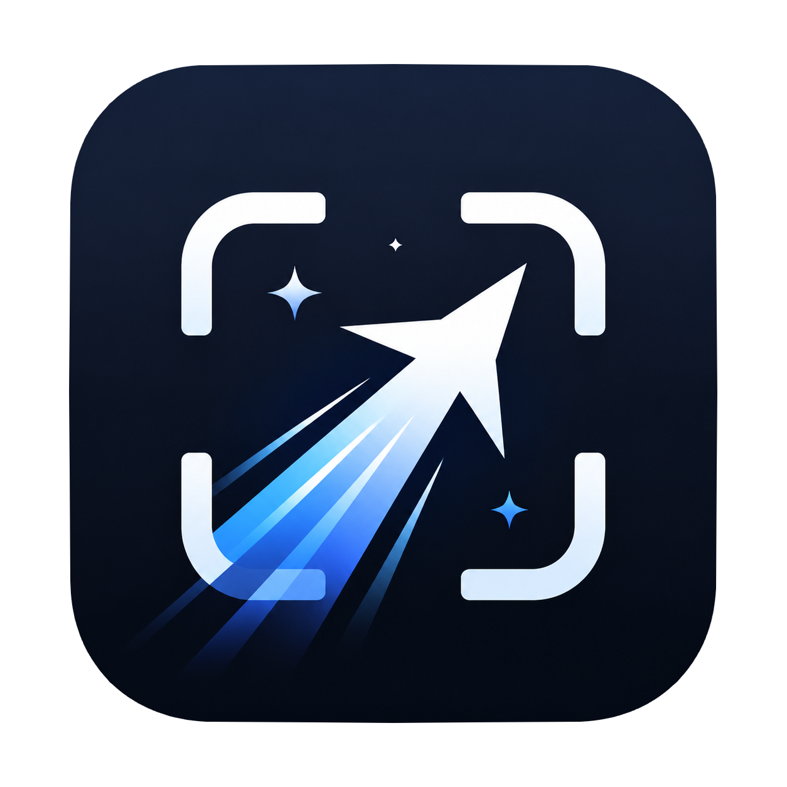
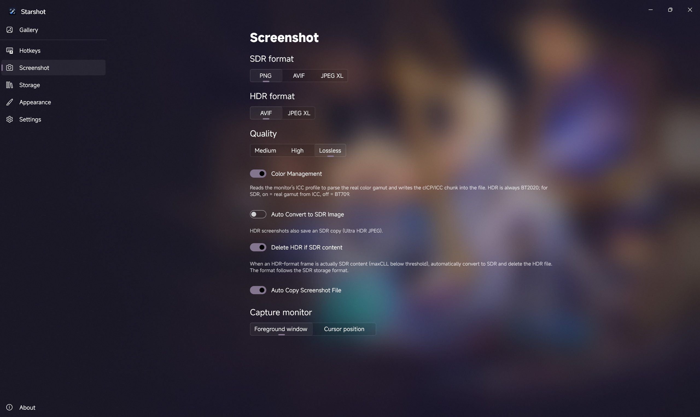

<div align="center">



# Starshot

**次世代 Windows ネイティブ HDR スクリーンショットツール**

**Next-generation Windows-native HDR Screenshot Tool**

16bit フルパイプラインキャプチャ · 領域スクリーンショット · AVIF / JPEG XL エンコード · カラーマネジメント

[](../../../releases)
[](https://github.com/loliri/Starshot?tab=MIT-1-ov-file)
[](../../../releases)

[ダウンロード](../../../releases) · [クイックスタート](#クイックスタート) · [機能詳細](#機能詳細) · [ソースからビルド](#ソースからビルド)

**[English](../README.md)** | **[简体中文](README.zh-CN.md)** | **[繁體中文](README.zh-TW.md)** | **日本語** | **[Français](README.fr.md)** | **[Русский](README.ru.md)** | **[Español](README.es.md)**

</div>

---

## なぜ Starshot が必要か

Windows 標準のスクリーンショットツール（Snipping Tool、Win+Shift+S）は、HDR ディスプレイ上でも 8bit SDR 画像しかキャプチャできません。システムコンポジターが 16bit HDR フレームを圧縮出力し、ハイライトがクリップされ、色域が狭められます。市場に出回っている一般的なスクリーンショットツール（ShareX など）も同様に、従来の GDI/BitBlt スクリーンショットパイプラインに制限されており、HDR データを認識できません。

Starshot は DXGI レイヤーからディスプレイ出力の生の `R16G16B16A16Float` scRGB フレームバッファを直接取得し、HDR 輝度情報（数千 nit に達する）を完全に保持します。16bit HDR AVIF または JPEG XL としてエンコードし、BT.2020 色空間 + PQ 伝達関数のメタデータを書き込みます。同時に、SDR ディスプレイ自動デグレード、領域スクリーンショット、マルチフォーマットバッチ変換など、汎用スクリーンショットツールに期待される機能も提供します。

**主な特徴**

- 🎯 **HDR フルパイプラインロスレス** — キャプチャ、エンコード、カラーマネジメントの全工程が 16bit、非可逆トーンマッピングなし
- 🧠 **スマート HDR/SDR 判定** — maxCLL ヒストグラムで真の HDR コンテンツと HDR フォーマットに包まれた SDR コンテンツを区別
- ✂️ **領域スクリーンショット** — フリーズフレーム・マルチディスプレイオーバーレイ、ウィンドウ検出 + 拡大鏡による精密なポイント選択
- 📋 **ネイティブクリップボード** — Win32 ネイティブ API でクリップボードに直接書き込み、WinRT の遅延レンダリングによる貼り付け失敗を回避
- 🗂️ **マルチフォーマット対応** — AVIF / JPEG XL / UHDR JPEG / PNG、バッチ変換ツール付き
- 📦 **インストール不要** — 解凍するだけですぐに使用可能、管理者権限不要

<div align="center">
<table>
<tr>
<td align="center" width="50%">

**他のツール**


</td>
<td align="center" width="50%">

**Starshot（Ultra HDR JPEG）**


</td>
</tr>
</table>
<sub>映像は「アークナイツ：エンドフィールド」より</sub>
</div>
</br>

> [!NOTE]
> GitHub プラットフォームは AVIF レンダリングをサポートしていないため、上記は Ultra HDR JPEG で表示しています。AVIF 原画は[こちら](https://r2.cialo.site/endfield/3840x2160.dlaa.avif)でご覧いただけます。

SDR ディスプレイでは、Starshot は自動的に標準 SDR スクリーンショットパスに切り替わり、汎用スクリーンショットツールとして動作します。HDR ディスプレイでは、現在数少ない HDR データを完全に保持できるデスクトップスクリーンショットソリューションです。

## システム要件

- Windows 10 / 11、最適な体験のために Windows 11 を推奨
- x64 アーキテクチャ
- **HDR スクリーンショット機能には HDR ディスプレイが必要**（SDR ディスプレイでは自動的に SDR パスに切り替わります）

## ダウンロード

[Releases](../../../releases) から圧縮パッケージをダウンロードし、解凍後にルートディレクトリの `Starshot.exe` ランチャーを実行してください。インストール不要、解凍するだけですぐに使用可能です。

## スクリーンショット



## クイックスタート

| 操作                                                         | デフォルトショートカット |
| ------------------------------------------------------------ | ------------------------ |
| 全画面スクリーンショット                                     | Alt+W                    |
| 領域スクリーンショット（選択後にファイル保存 + クリップボードにコピー） | Alt+Q                    |
| 領域コピーのみ（選択後にクリップボードにコピーのみ、ファイル保存なし） | Alt+A                    |

すべてのショートカットは設定でカスタマイズ可能です。

## 機能詳細

### HDR スクリーンショットパイプライン

ほとんどのスクリーンショットツールは HDR ディスプレイ上でも 8bit SDR しかキャプチャできません。システムコンポジターが出力する 16bit 浮動小数点 scRGB フレームが SDR に圧縮され、ハイライトがクリップされ、色域が狭められます。Starshot は**生の HDR フレームバッファ**をキャプチャします：

1. **HDR キャプチャ**：ディスプレイが HDR を報告した場合、`R16G16B16A16Float` ピクセルフォーマットを要求し、完全な scRGB 浮動小数点データ（輝度は数千 nit に達する）を取得します
2. **HDR 保存**：16bit AVIF / JPEG XL、BT.2020 色域 + PQ 伝達関数。ハイライトはクリップされず、色域は狭まりません
3. **maxCLL 計算**：Win2D ヒストグラム効果で最大コンテンツ輝度を計算し、真の HDR コンテンツと HDR フォーマットの SDR コンテンツを区別します
4. **カラーマネジメント**：ディスプレイ ICC プロファイルを読み取り、実際の色域原色を解析し、ファイルの cICP/ICC チャンクに書き込みます。HDR は BT.2020 に強制、SDR は切り替え可能（オン = ICC 実色域を読み取り、オフ = BT.709）

#### SDR コンテンツの取り扱い

HDR ディスプレイでは、デスクトップと SDR アプリケーションも HDR フォーマット（R16G16B16A16Float）でキャプチャされますが、コンテンツの輝度は実際には SDR レベルです。これに対する Starshot の処理：

- **デフォルト**：引き続き HDR フォーマットで保存（16bit）、**8bit トーンマッピングは行わず**、劣化や色ずれを防止します
- **SDR コンテンツの HDR 削除スイッチ**（オプション）：有効にすると maxCLL 閾値で検出し、基準に満たないコンテンツは自動的に SDR に変換（ユーザー設定の SDR 保存形式に従う）し、HDR ファイルを削除して容量を節約します

#### UHDR JPEG フォールバック

HDR スクリーンショットは Ultra HDR JPEG（SDR ベース画像 + HDR ゲインマップ）を同時に保存でき、HDR 非対応のソフトウェアでも正常に表示されます。`Starward.Codec` の `UhdrEncoder` でエンコードされます。

#### 領域スクリーンショット HDR トレードオフ

領域スクリーンショットのオーバーレイは、HDR フレームを**意図的に** SDR にトーンマッピングして表示します。WinUI の `CanvasControl` が SDR スワップチェーンを使用するため、scRGB 浮動小数点をそのまま出力すると色ずれや黒つぶれが発生するからです。**保存されるファイルは完全な HDR** であり、変更されません。選択時のハイライト圧縮はプレビューのみに影響し、出力には影響しません。

### 3 つのスクリーンショットモード

| モード             | 対象                                               | クリップボード形式        | ファイル |
| ------------------ | -------------------------------------------------- | ------------------------- | -------- |
| 全画面             | モニター全体（前面ウィンドウ/カーソルがある画面、切り替え可能） | CF_HDROP（ファイル）      | 保存     |
| 領域               | 範囲選択 / ウィンドウクリック                      | CF_DIB（BGRA ビットマップ） | 保存     |
| 領域コピーのみ     | 範囲選択 / ウィンドウクリック                      | CF_DIB（BGRA ビットマップ） | 保存なし |

3 つのモードは HDR 検出、カラーマネジメント、ファイル名テンプレート、保存パイプライン、情報トーストを共有します。

### 領域スクリーンショットオーバーレイ

- **フリーズフレーム**：最初にすべてのモニターを 1 枚のビットマップに合成し、オーバーレイにフリーズフレームを表示——選択中に画面が動かず、オーバーレイはスクリーンショットに含まれません
- **マルチディスプレイ**：仮想画面全体をカバー。拡大鏡と座標ボックスはカーソルのあるディスプレイに制限されます（画面をまたがない）
- **ウィンドウ検出**：EnumWindows + DWM cloaked/toolwindow フィルタリング + DWM 拡張境界（シャドウ除去）+ クライアント領域デュアル候補 + Z オーダー選択、ウィンドウをクリックして直接キャプチャ（QuickCrop）
- **拡大鏡**：NearestNeighbor 整数アライメント + ピクセルグリッド（15×15 ピクセル、各 10px）、ピクセルが鮮明に識別可能
- **アニメーション選択枠 + リアルタイム座標**：選択範囲 X/Y/W/H + カーソル物理座標
- **ピクセル精度**：ドラッグ選択 +1px、ウィンドウ矩形 +0
- ESC / 右クリックでキャンセル、Enter でウィンドウホバー確定

### クリップボード

パッケージ化されていない WinUI アプリの WinRT `Clipboard.SetContent` は信頼性が低く（遅延レンダリング + Flush 問題、コンテンツが他のアプリケーションに届かないことがよくあります）、Starshot は Win32 ネイティブ API（`OpenClipboard` / `SetClipboardData`）を直接使用します：

- **全画面スクリーンショット**：CF_HDROP（ファイルドロップ形式）、エクスプローラーやチャットアプリに貼り付けて直接ファイルを取得
- **領域スクリーンショット**：CF_DIB（BGRA ビットマップ）、オーバーレイから切り取った SDR ビットマップを直接クリップボードに配置、ファイル読み取りなし、再エンコードなし、二次トーンマッピングなし
- 任意のスレッドから呼び出し可能、10×20ms リトライでクリップボード競合に対応

### 保存

- **フラット構造**（サブフォルダなし）、デフォルトは `ピクチャ\Starshot`、カスタマイズ可能
- **SDR フォーマット**（PNG / AVIF / JPEG XL、デフォルト PNG）と **HDR フォーマット**（AVIF / JPEG XL、デフォルト AVIF）を個別に設定
- 品質：中 / 高 / ロスレス
- XMP メタデータ（CreatorTool = Starshot）
- エンコード直列化（SemaphoreSlim）、並行エンコード競合を防止
- **ストレージ統計**：設定ページでスクリーンショット / サムネイルキャッシュ / 壁紙 / ログ / バックアップの各占有容量を表示、更新とワンクリックキャッシュクリアに対応（孤立した壁紙ファイルも合わせてクリーンアップ）

#### 対応フォーマット

| フォーマット | ビット深度              | HDR 対応                      | 用途                     |
| ------------ | ----------------------- | ----------------------------- | ------------------------ |
| PNG          | 8bit / 16bit            | HDR 保存可能だが互換性低い    | SDR デフォルト、ロスレス |
| AVIF         | 8bit / 10bit / 12bit    | 完全 HDR                      | HDR デフォルト、高圧縮率 |
| JPEG XL      | 8bit / 16bit            | 完全 HDR                      | HDR 代替、可逆圧縮       |
| UHDR JPEG    | 8bit + ゲインマップ     | SDR 互換 HDR フォールバック   | HDR 追加出力             |

### ファイル名テンプレート

全画面スクリーンショットと領域スクリーンショットは**独立したテンプレート**を使用します。

| プレースホルダー                                          | 意味                             | 例                  |
| --------------------------------------------------------- | -------------------------------- | ------------------- |
| `{process}`                                               | プロセス名（拡張子なし）         | `explorer`          |
| `{processPath}`                                           | exe ファイル名（拡張子付き）     | `explorer.exe`      |
| `{title}`                                                 | ウィンドウタイトル（trim + 切り詰め長さ設定可能） | `Genshin Impact`    |
| `{timestamp}`                                             | Unix タイムスタンプ              | `1721234567`        |
| `{time}`                                                  | yyyyMMdd_HHmmssff                | `20260718_14302512` |
| `{date}`                                                  | yyyyMMdd                         | `20260718`          |
| `{width}` `{height}`                                      | 画像サイズ（px）                 | `1920` `1080`       |
| `{year}` `{month}` `{day}` `{hour}` `{minute}` `{second}` | 時刻の各成分                     |                     |

ファイル名に使用できない文字は一律 `_` に置換されます。

### 情報トースト

スクリーンショット後にサムネイル + ステータストーストがポップアップします（スクリーンショットに影響しません——`WDA_EXCLUDEFROMCAPTURE` が設定されており、他のスクリーンショットツールはこのウィンドウをキャプチャできません）：

- **処理中**（回転アニメーション）/ **保存済み**（開くボタン付き）/ **コピー済み**（緑のチェック）/ **失敗**
- 連続撮影カウンター（例：2/3）
- Composition アニメーション スライドイン/スライドアウト

### スクリーンショットライブラリ

- マルチフォルダブラウジング（デフォルトのスクリーンショットディレクトリ + ユーザー追加フォルダ）
- `FileSystemWatcher` によるリアルタイムの追加/削除検知
- 日付ごとにグループ化、サムネイル遅延読み込み
- 右クリックメニュー：開く / ファイルをコピー / JPG としてコピー / エクスプローラーで開く / プログラムを開く / 削除
- 複数選択 + ドラッグアウト + バッチ変換エントリ

### 画像ビューア

- ズーム（スライダー / ボタン / マウスホイール / ダブルクリックでフィット）、フルスクリーンモード（F11）
- 前へ / 次へ（矢印キー、マウスホイール、下部サムネイルストリップ）
- ファイルをドラッグ＆ドロップして直接開く
- 右クリックメニュー：ファイル / パス / 画像をコピー、削除、エクスプローラーで開く、プログラムを開く
- **編集パネル**：HDR / SDR / Auto 表示モード切り替え、SDR 輝度スライダー（100–500 nit）、画像とディスプレイ情報
- **フォーマット変換**：PNG / AVIF / JPEG XL（SDR ディスプレイ）または UHDR JPEG / AVIF / JPEG XL（HDR ディスプレイ）としてエクスポート
- **カラーマネジメント**：ディスプレイ ICC プロファイルと AdvancedColorInfo を読み取り

### バッチフォーマット変換

| 変換方向                             | エンジン                             |
| ------------------------------------ | ------------------------------------ |
| JPG / PNG → AVIF / JXL               | avifenc.exe / cjxl.exe（CLI）        |
| AVIF / JXL → JPG / PNG               | avifdec.exe / djxl.exe（CLI）        |
| JXR / WEBP / HEIC 等 → AVIF / JXL    | プロセス内 ImageSaver（avifEncoderLite） |

### パーソナライゼーション

- **カスタム壁紙**：3 つのモード
  - **画像指定**：画像を 1 枚選んで固定表示
  - **動画指定**：ループミュート再生、メインウィンドウ非表示時に自動一時停止
  - **フォルダランダム**：起動ごとにフォルダからランダムに 1 枚（画像または動画を混在選択）
  - 壁紙ソース紛失の自動検出、設定クリーンアップと壁紙なし + トースト通知にフォールバック
- **アクセントカラー**：
  - **壁紙から自動抽出**（デフォルトオン）：壁紙の主要色をサンプリングしてアプリアクセントカラーに（HSV 彩度ブースト）；動画は最初のフレームのみサンプリングし、色のちらつきを防止
  - **カスタムカラー**：手動カラーピッカーで自動抽出を上書き
- **テーマ**：システムに従う / ライト / ダーク
- **アクリル効果**：壁紙モード時にフロストガラス中間層または壁紙の直接透過を選択可能

### スプラッシュスクリーン

起動時にロゴ + キャッチフレーズを表示。700ms 遅延後、400ms でフェードアウト。初回ウィンドウ表示時のみ発動し、タスクトレイからの復帰時は再表示されません。

### システムトレイ

- 左クリックでメインウィンドウを表示、右クリックでコンテキストメニュー（表示 / 終了）
- メインウィンドウを閉じるとタスクトレイに最小化（切り替え可能）
- `ForceExit` メカニズムにより、トレイからの「終了」が確実に終了することを保証

### 起動時の自動起動

- レジストリ `HKCU\Software\Microsoft\Windows\CurrentVersion\Run`、ランチャー（ルート `Starshot.exe`）を指します
- オプション `--hide` でトレイに最小化して起動（トレイが有効である必要あり）
- スイッチはレジストリをリアルタイム読み取り（データベースキャッシュなし）：タスクマネージャーからの無効化は StartupApproved のみを変更し、Run エントリを削除しないため、スイッチは依然としてオンと表示されます
- 起動時に自動起動エントリが指す exe の存在を確認し、存在しない場合は自動的に起動エントリを削除してトースト通知

### 更新チェック

- 起動時にスロットルチェック（≥24h + スイッチオン）で GitHub Releases の最新バージョンを確認、または About ページから手動チェック
- 更新は SharpCompress の真のストリーミング解凍（ネットワークストリーム直結、zip をディスクに保存しない）を使用し、エントリごとに直接ルートディレクトリに書き込み
- 失敗時は復元、成功時はランチャーを `--clean` 付きで再起動して古いバージョンをクリーンアップ
- CI/CD リリースのみチェック（`version.ini` のバージョン番号を読み取り）；ローカルビルド（`version.ini` なし、`AppVersion = Local`）は 0.0.0 として扱われ、任意の CI/CD リリースに更新可能
- バージョン大文字小文字の規約：GitHub tag、zip 名、`app-{version}/` ディレクトリはすべて小文字（例: `0.3.1-preview`）；`version.ini` の内容は元の大文字小文字を維持（`0.3.1-Preview`、About ページ表示用）、ランチャーは読み取り時に小文字に変換してディレクトリを特定

## アーキテクチャ

### ディレクトリ構造

```
ルート/
  Starshot.exe            ← C++ ランチャー（version.ini を読み取り、どの app ディレクトリを起動するか決定）
  StarshotDatabase.db     ← SQLite 設定データベース
  version.ini             ← バージョン番号（CI/CD リリースのみ、ローカルビルドにはなし）
  app-{version}/          ← メインプログラムディレクトリ（CI/CD リリースはバージョン付き、ローカルビルドは app/）
    Starshot.exe          ← メインプログラム（WinUI 3 / .NET 10）
    *.dll                 ← 依存ライブラリ
    avifenc.exe 等        ← コーデックツール（Starward.Codec NuGet より）
  backup/                 ← データベースバックアップ
%LOCALAPPDATA%/Starshot/ （デフォルト、設定可能）
  log/                    ← ログ
  bg/                     ← 壁紙
  thumb/                  ← サムネイルキャッシュ
```

### ランチャー

C++ ネイティブプログラム（~400KB）。`version.ini` を読み取り、`app-{version}/Starshot.exe` を起動するか（version.ini がない場合は `app/`、debug/local ビルド）を決定します。`--clean`（または `--clean=<pid>`）付きで起動すると、`app-*` ディレクトリを走査して現在のバージョン以外を削除します。

### トレイとバックグラウンド起動

- `--hide`：自動起動時に MainWindow を作成せず、グローバルホットキーを SystemTrayWindow の hwnd に登録（トレイウィンドウを常駐ホストとして使用）
- H.NotifyIcon.WinUI の TaskbarIcon は、アイコン登録のために Window の 1 回の Show による `Loaded` トリガーに依存します。初期化時に `WS_EX_LAYERED + alpha=0` を適用してウィンドウを透過的にこの Show を完了させ、`--hide` 自動起動時の可視フラッシュを防止します
- C++ ランチャーは `argv[1..]` を再結合してコマンドライン引数を透過的に渡します

### 技術スタック

| 層                   | 技術                                                                |
| -------------------- | ------------------------------------------------------------------- |
| UI フレームワーク    | WinUI 3（Windows App SDK 1.8）                                      |
| ランタイム           | .NET 10                                                             |
| グラフィックス       | Win2D 1.3（D3D11 相互運用、HDR トーンマッピング、ヒストグラム効果） |
| コーデック           | Starward.Codec NuGet（libavif / libjxl / UltraHDR P/Invoke ラッパー） |
| データストレージ     | SQLite + Dapper                                                     |
| ログ                 | Serilog                                                             |
| システムトレイ       | H.NotifyIcon.WinUI                                                  |
| サムネイル           | Scighost.WinUI ImageEx + カスタム CachedImage                       |
| 領域オーバーレイ     | Win2D CanvasControl（フリーズフレームレンダリング + 選択範囲描画）  |
| クリップボード       | Win32 ネイティブ API（OpenClipboard / SetClipboardData）            |
| ランチャー           | C++ ネイティブ（v145 ツールセット、静的 CRT）                      |

### 再入防止

`Interlocked.CompareExchange` グローバルガード。全画面/領域/コピー専用で 1 つの `_isCapturing` フラグを共有——キーボードの連打や高速な連続ホットキー押下で複数回のキャプチャがトリガーされることはありません。

### ビルド構成

|                  | Debug                                       | Release                                                                                             |
| ---------------- | ------------------------------------------- | --------------------------------------------------------------------------------------------------- |
| .NET Runtime     | Framework-dependent（パッケージ化なし）     | 自己完結型                                                                                          |
| ネイティブライブラリ | win-x64 のみ（RuntimeIdentifier、出力ルートにフラット配置） | Debug と同じ                                                                                        |
| Trim             | いいえ                                      | partial                                                                                             |
| ReadyToRun       | いいえ                                      | はい                                                                                                |
| 追加クリーンアップ | —                                           | DirectML.dll / onnxruntime.dll / NpuDetect を削除（Windows App SDK の WinML/AI コンポーネント、本アプリ未使用） |
| 出力パス         | `build/app/`                                | `build/release/app/` + ランチャーを `build/release/` にコピー                                       |
| サイズ           | ~80MB                                       | より小さい（Trim + AI ライブラリ削除）                                                              |

## ソースからビルド

### 環境要件

- Visual Studio 2022 / 2026（C++ デスクトップ開発、.NET デスクトップ開発を含む）
- .NET 10 SDK
- Windows SDK 10.0.26100

### 手順

```bash
git clone https://github.com/loliri/Starshot
cd Starshot

# === Debug ===
# メインプログラムをビルド（build/app/ に出力）
dotnet build src/Starshot/Starshot.csproj -c Debug -p:Platform=x64

# ランチャーをビルド（build/Starshot.exe に出力、VS の MSBuild が必要）
"C:\Program Files\Microsoft Visual Studio\<バージョン>\Community\MSBuild\Current\Bin\MSBuild.exe" src/Starshot.Launcher/Starshot.Launcher.vcxproj -p:Configuration=Release -p:Platform=x64

# 実行：build/Starshot.exe（ランチャー）または build/app/Starshot.exe（メインプログラム）

# === Release 公開 ===
# 1. 最初にランチャーをビルド（build/Starshot.exe に出力）
"C:\Program Files\Microsoft Visual Studio\<バージョン>\Community\MSBuild\Current\Bin\MSBuild.exe" src/Starshot.Launcher/Starshot.Launcher.vcxproj -p:Configuration=Release -p:Platform=x64

# 2. メインプログラムを公開（build/release/app/ に出力、ランチャーを build/release/Starshot.exe に自動コピー + AI ライブラリ削除）
dotnet publish src/Starshot/Starshot.csproj -c Release -p:Platform=x64

# 完了後のディレクトリ構造：
# build/release/
#   Starshot.exe        ← ランチャー（自動コピー）
#   app/
#     Starshot.exe      ← メインプログラム（自己完結型 + trim + R2R）
#     *.dll / avifenc.exe 等
```

## 既知の制限事項

- 領域スクリーンショットオーバーレイの HDR フレームは SDR として表示されます（WinUI CanvasControl が SDR スワップチェーンを使用）；保存されるファイルには影響しません
- カスタム壁紙は `UniformToFill` でウィンドウを埋めますが、WinUI のクロップは中央揃えではなく、現在は**左上**揃えです。例えば、狭い（縦向き）壁紙を広いウィンドウに表示すると、上半分のみが表示されます（中央ではなく上部からクロップ）
- 領域スクリーンショットオーバーレイを開いた瞬間、カーソルはまだシステムデフォルトの形状です。**マウスを 1 回動かすと**十字カーソルが表示されます（WinUI `ProtectedCursor` は要素上に既にある静止ポインタに対して即時に効果を発揮しません。1 回動かして pointer イベントをトリガーすると正常になります）
- デュアルモニターで DPI が異なる場合（例: プライマリ 150%、セカンダリ 125%）、領域キャプチャオーバーレイの座標がセカンダリモニターでずれます（ルーペ / 選択がずれる）。回避策: 両モニターのスケールを統一する

## 国際化（i18n）

翻訳は `src/Starshot.Language/` の `.resx` ファイルに基づきます（`Lang.resx` が英語デフォルト、`Lang.zh-CN.resx` 等が各言語）。また `GeneralSetting` の言語 ComboBox にオプションを追加 + `LanguageIndex` マッピングも必要です。

翻訳の貢献歓迎：リポジトリを fork → `Lang.resx` を `Lang.{あなたの言語}.resx` にコピー → 翻訳 → PR を送信。

## 開発ノート

本プロジェクトは開発段階にあり、機能は随時変更される可能性があります。最新情報にご注意ください！

参加を歓迎します：

- バグを発見？[Issue を送信](../../../issues/new)
- 機能の提案がある？[ディスカッションを開始](../../../issues/new)
- コードを貢献したい？[Pull Request](../../../pulls) を歓迎します

## よくある質問

<details>
<summary><b>スクリーンショットライブラリ（ホームページ）の画像の色がおかしい / 乱れている</b></summary>

これは通常、Windows システムの画像デコーダー（AVIF / HEIF / JPEG XL 拡張機能）の問題であり、Starshot のバグではありません。Microsoft Store で以下のコンポーネントを検索して更新してみてください：

- **AV1 Video Extension**
- **HEIF Image Extensions**
- **HEVC Video Extensions**
- **Webp Image Extensions**

更新後に Starshot を再起動してください。問題が解決しない場合は、スクリーンショットを添付して [Issue を送信](../../../issues/new) してください。

</details>

<details>
<summary><b>スクリーンショットの色が画面で見ているものと異なる</b></summary>

HDR ディスプレイを使用している場合、Windows HDR スイッチがオンになっていることを確認してください（設定 → システム → ディスプレイ → HDR）。HDR スクリーンショット機能は HDR モードでのみ有効です。

</details>

<details>
<summary><b>スクリーンショット後にクリップボードから貼り付けられない</b></summary>

Starshot は Win32 ネイティブクリップボード API を使用して書き込んでおり、理論的には WinRT よりも信頼性が高いです。それでも貼り付けに失敗する場合は、対象アプリケーションが対応するクリップボード形式（CF_HDROP ファイル / CF_DIB ビットマップ）をサポートしていない可能性があります。エクスプローラー（ファイル）またはペイント（ビットマップ）に貼り付けて検証してみてください。

</details>

## 謝辞

- [Starward](https://github.com/Scighost/Starward) — スクリーンショットコア、コーデックエンジン、ウィンドウフレームワークはすべて Starward に由来し、[@Scighost](https://github.com/Scighost) によって開発されました
- [ShareX](https://github.com/ShareX/ShareX) — 領域スクリーンショットオーバーレイのウィンドウ検出とインタラクションデザインの参考

**および使用しているすべてのサードパーティライブラリ**：

- [CommunityToolkit](https://github.com/CommunityToolkit) — MVVM フレームワーク + WinUI コントロール（Segmented / Behaviors / Helpers）
- [SharpCompress](https://github.com/adamhathcock/sharpcompress) — ストリーミング解凍
- [Dapper](https://github.com/DapperLib/Dapper) — SQLite 軽量 ORM
- [H.NotifyIcon.WinUI](https://github.com/HavenDV/H.NotifyIcon) — システムトレイ
- [Vanara.PInvoke](https://github.com/dahall/Vanara) — Win32 API ラッパー（DwmApi / Ole / Shell32）
- [ComputeSharp.D2D1](https://github.com/Sergio0694/ComputeSharp) — GPU コンピュートエフェクト
- [Serilog](https://github.com/serilog/serilog) — 構造化ログ

## License

MIT
